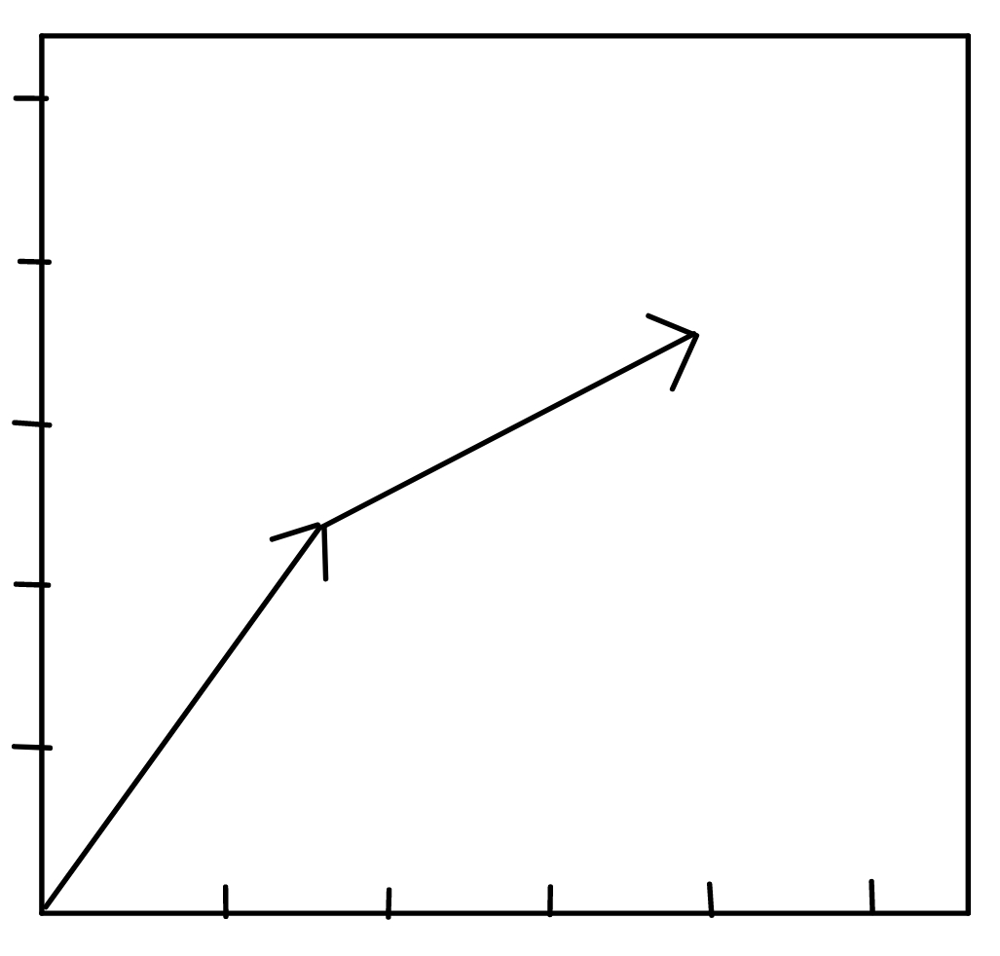
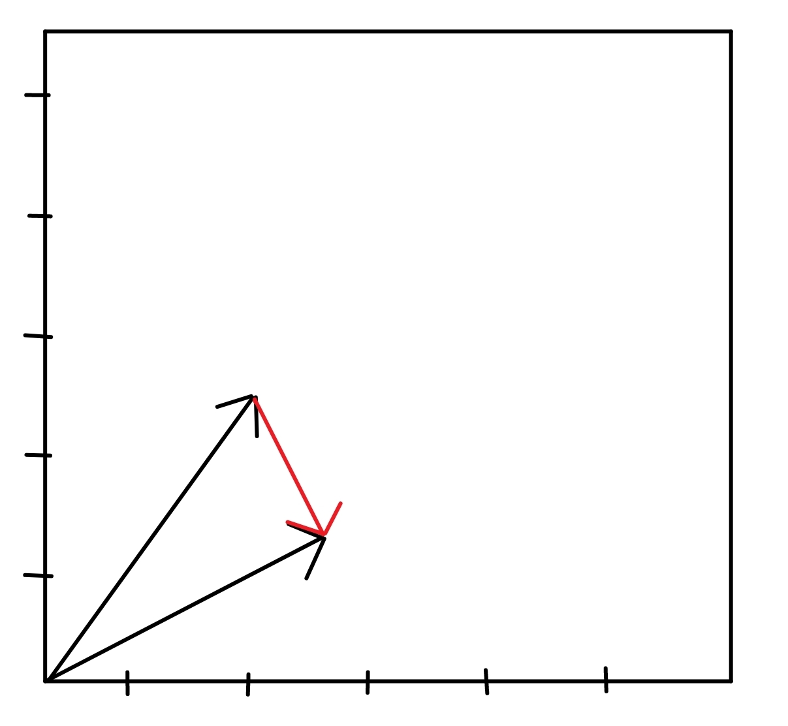

=======
Metrics
=======

----------------------
NEEM Experience Metric
----------------------

The NEEM Experience consists of the TF frames for each object during the execution of the task recorded in the NEEM.
Therefore the NEEM Experience are basically trajectories of different objects in during the task, especially interesting
are the hands in this case.

To evaluate the trajectory of an object we try to measure how "smooth" the trajectory is. This is done by checking how
often the trajectory rapidly changes direction. We do this by calculating the difference between the current and the
next direction vector of the trajectory. The direction vectors are normalized to account for different movement speeds
during execution. If the difference vector is then greater than 1 we count it as a rapid change of direction.

In this image you can see a simple example of a trajectory. Think of the arrows as connecting the positions of the
TF frames of the object. Now we want to see how much the trajectory changes direction.

The arrows are still the same but moved a bit to the side to make the direction vectors more visible. The red arrow is
the difference vector between the two direction vectors. When we now calculate the length of the difference vector we
get the distance by how much the trajectory changes direction. If this distance is greater than 1 we count it as a hit
for the metric.

---------------------
NEEM Behaviour Metric
---------------------

The NEEM Behaviour metric is an ensemble of different metrics that each measure different aspects of the semantic events
contained in a NEEM. This ensemble is used, instead of a single metric, to account for the different kinds of contexts
in which the NEEM was recorded. Since different metrics might be good or bad depending on the context in which the NEEM
was recorded, we use an ensemble of metrics to account for this. Furthermore, to take the context into account all
metrics are calculated between the NEEM that should be evaluated and an "optimal" NEEM which represents the task how
it should be executed. This "optimal" NEEM is created by a human expert and contains all the semantic events that should
have been executed during the task.

The metrics that are used in the ensemble are:

* Co-appearance of semantic events: This metric measures how often two semantic events appear together in the NEEM.
* Relative distance of events: This metric measures how far apart two semantic events are in the NEEM.
* Events ordered by time: This metric orders all semantic events by their time of execution and then compares the
  order of the events in the NEEM to the order of the events in the "optimal" NEEM.
* Count for each event type: This metric counts how often each semantic event type appears in the NEEM and compares
  it to the "optimal" NEEM.
* Total execution time: This metric measures the total execution time of each NEEM and returns them side-by-side.
* Failed grasp events: This metric counts how often a grasp event failed, meaning how often a grasping event was not
followed by a pouring event.

